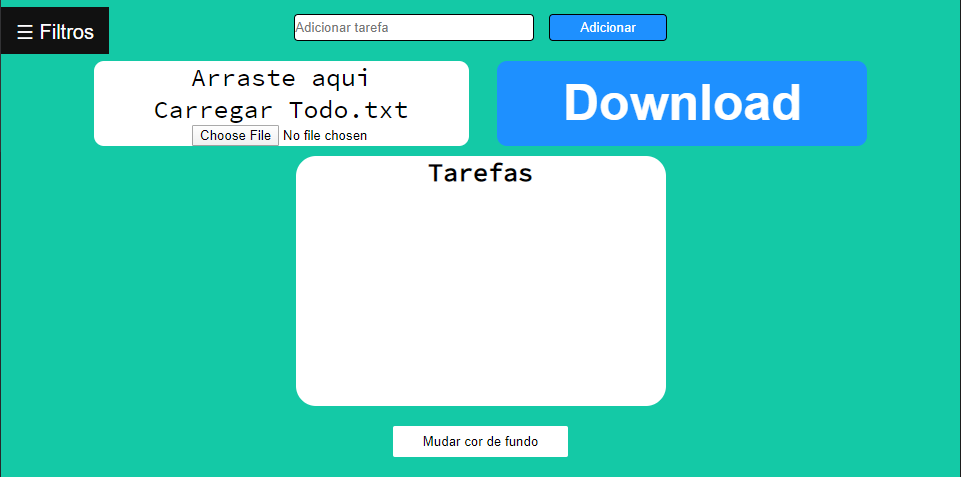
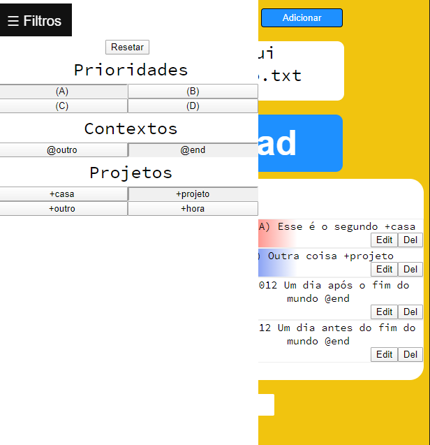
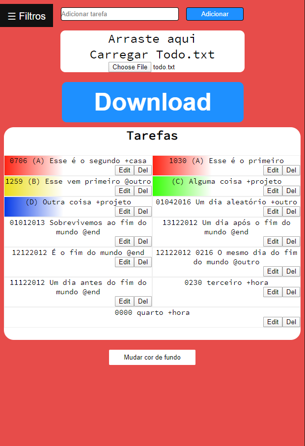
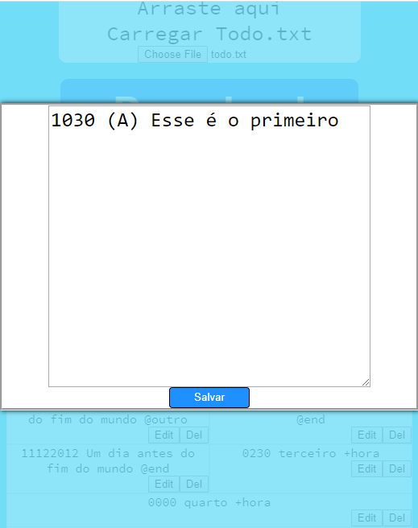

# Todo.txt em HTML/CSS/JavaScript
>> O projeto IF968 em JavaScript, para demonstrar aptidão mínima na linguagem

## Features

- [x] Cores para as tarefas com prioridade A-D
- [x] Espaço para adição de novas tarefas
- [x] Botão para edição da tarefa
- [x] Botão para remoção da tarefa
- [x] Espaço para importar um todo.txt
- [x] Botão para download do todo.txt
- [x] Filtragem por prioridade/contexto/projeto
- [x] Filtragem de mais de um seletor
- [x] Modificador de cor de background
- [x] Bugs corrigidos e transições adicionadas

## Links importantes
[Projeto IF968](https://github.com/JDaniloC/Projeto-IF968-2019):

    A idéia foi se inspirar neste projeto, mas dessa vez em JavaScript

<a href="https://github.com/JDaniloC/Projeto-IF968-2019" align="right">
    
 <i> O repositório inspiração </i> 

  
</a>

[Color Picker](https://github.com/jillix/piklor.js/):
    
    O objeto que foi usado para o seletor de cores.

[Skylab](https://skylab.rocketseat.com.br/?to=%2Fjourney%2Fstarter):

    Um ótimo curso rápido de JavaScript que incentivou também

