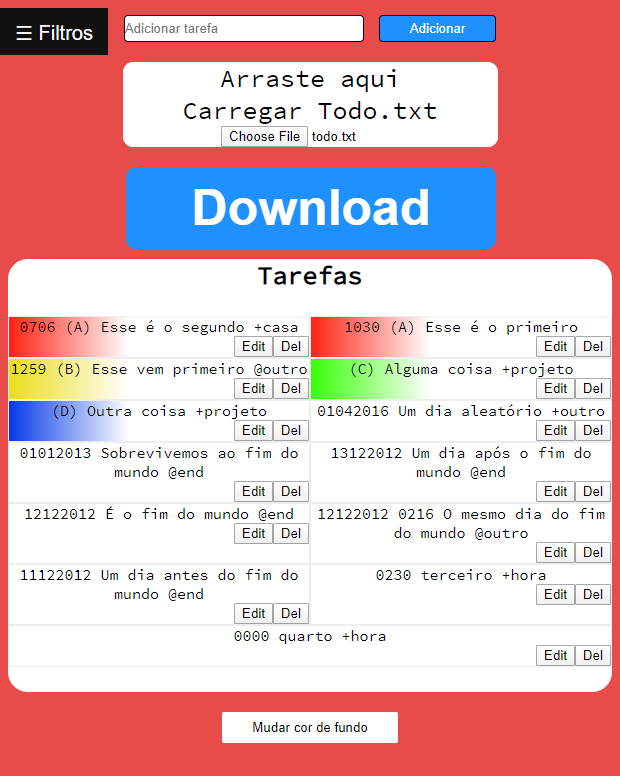

# Todo.txt em HTML/CSS/JavaScript
>> O projeto IF968 em JavaScript, para demonstrar aptidão mínima na linguagem

## Features

- [x] Cores para as tarefas com prioridade A-D
- [x] Espaço para adição de novas tarefas
- [x] Botão para edição da tarefa
- [x] Botão para remoção da tarefa
- [x] Espaço para importar um todo.txt
- [x] Botão para download do todo.txt
- [x] Filtragem por prioridade/contexto/projeto
- [x] Filtragem de mais de um seletor
- [x] Modificador de cor de background
- [x] Bugs corrigidos e transições adicionadas

## Links importantes
A idéia foi se inspirar no [Projeto IF968](https://github.com/JDaniloC/Projeto-IF968-2019) só que em JavaScript

O [Color Picker](https://github.com/jillix/piklor.js/) foi usado para o seletor de cores.

